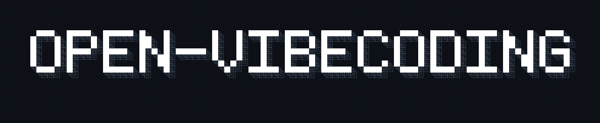
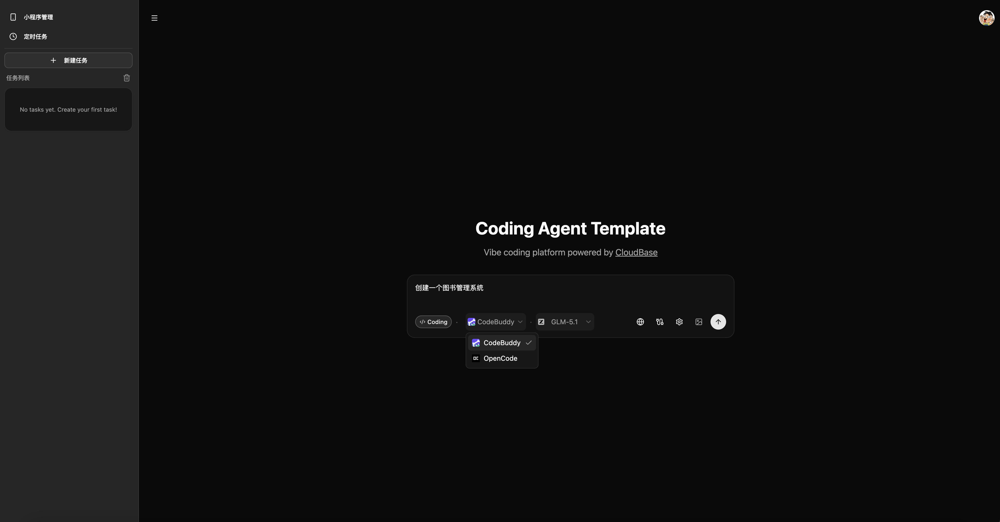
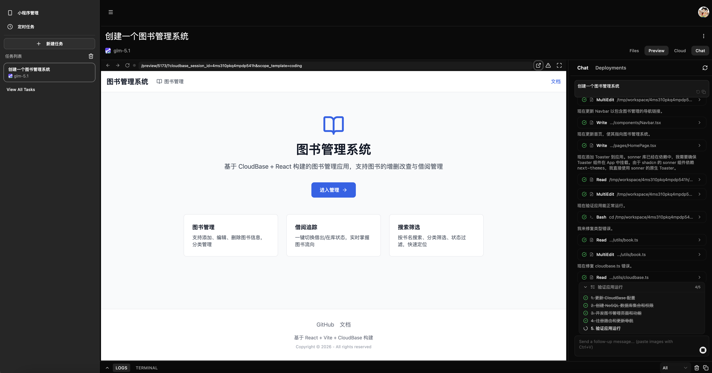
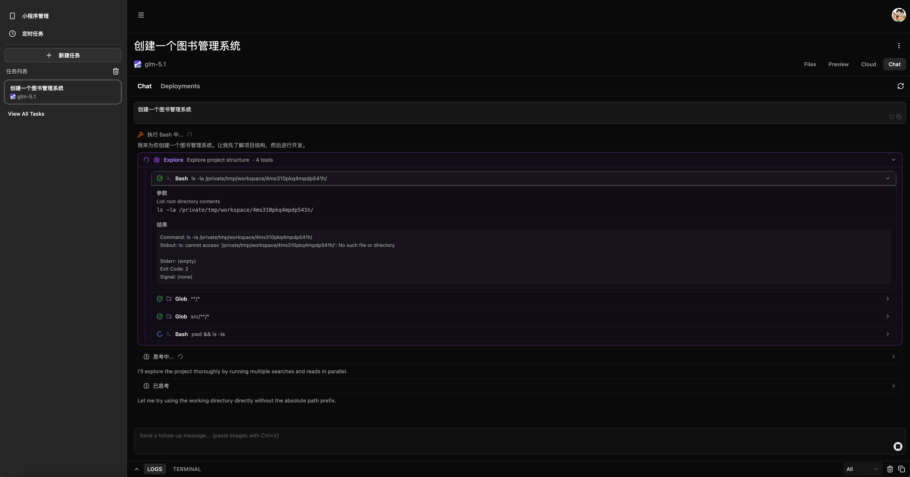
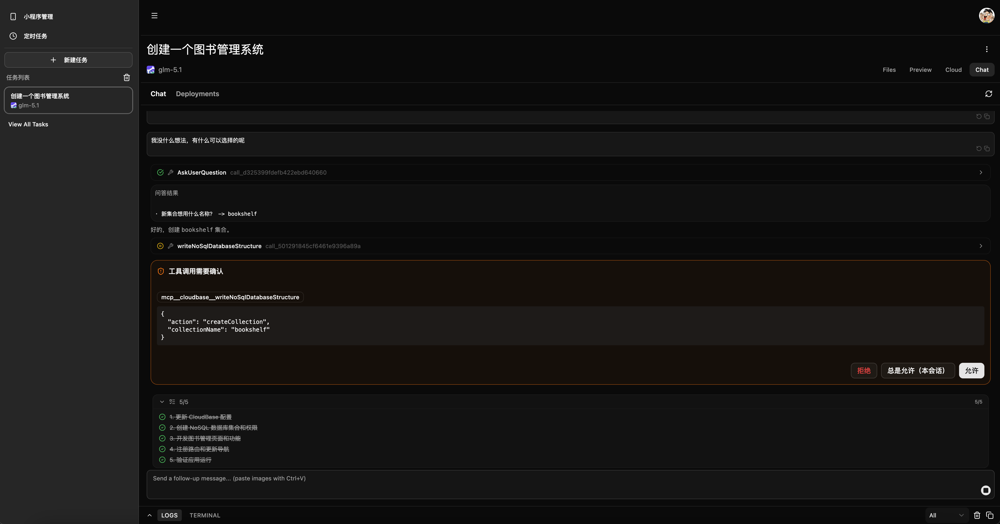
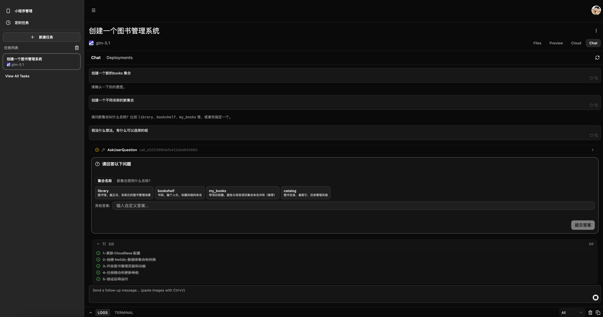
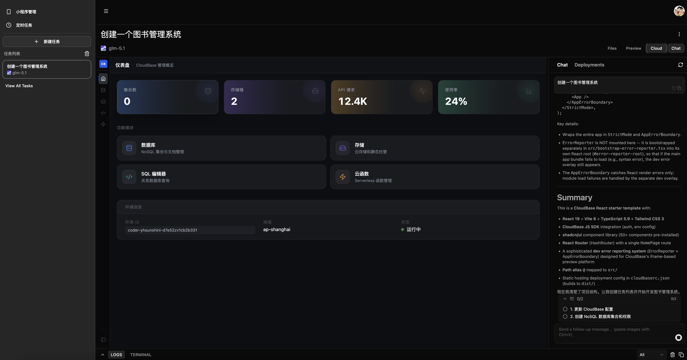
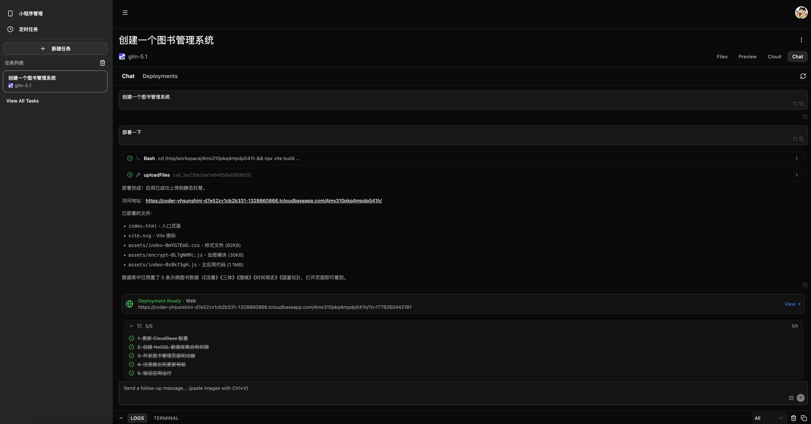
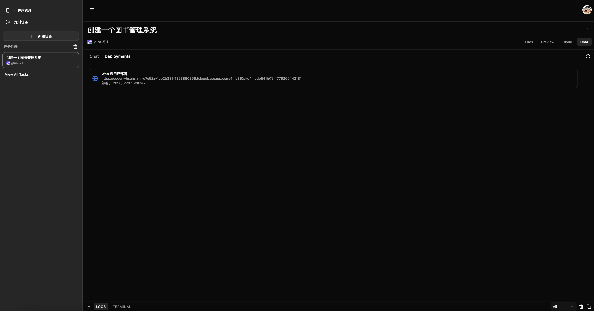
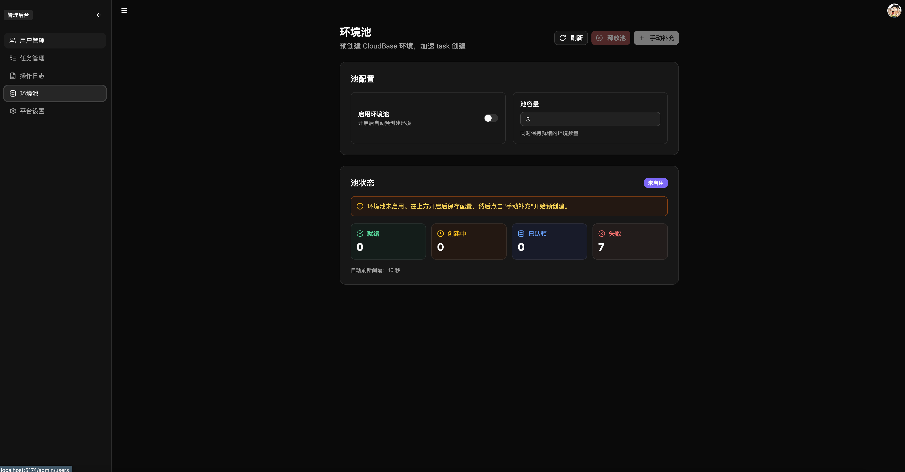

<p align="center">
  
</p>

<p align="center">
  基于腾讯云 CloudBase 构建的开源 AI 全栈应用开发平台 — 对话式生成代码、实时预览、一键部署。
</p>

<p align="center">
  <b>🔥 <a href="https://developers.openai.com/codex/sites">OpenAI Codex Sites</a> 的开源平替</b><br/>
  自托管 · 多框架 · 多 Agent · 代码、云、数据全在你自己手里。
</p>

<p align="center">
  <a href="./LICENSE"></a>
  <a href="https://pnpm.io/"></a>
  <a href="https://nodejs.org/"></a>
  <a href="https://www.typescriptlang.org/"></a>
  <a href="https://cloudbase.net/"></a>
</p>

<p align="center">
  <a href="#快速开始">快速开始</a> ◆
  <a href="./docs/architecture.md">架构</a> ◆
  <a href="./docs/setup.md">部署</a> ◆
  <a href="#加入交流群">交流群</a> ◆
  <a href="./README.md">English</a>
</p>

---

## Overview

[OpenAI Codex Sites](https://developers.openai.com/codex/sites) / [Lovable](https://lovable.dev) / [v0](https://v0.dev) / [bolt.new](https://bolt.new) 的开源替代方案 — 基于腾讯云 CloudBase 构建的 AI 全栈应用开发平台。一句话描述需求，Agent 写代码，实时预览，一键部署。支持双 Agent 运行时（CodeBuddy / OpenCode）、三级环境隔离，全部跑在你自己的云上。

> **为什么是现在**：OpenAI 在 2026 年 6 月发布了 Codex Sites，让 ChatGPT Business / Enterprise 用户可以用自然语言描述网站，由 Codex 部署到 OpenAI 托管的 Cloudflare Workers 上。功能很好，**但是** —— 闭源、框架锁定（只能输出 Workers ES module）、Agent 锁定（只能用 OpenAI）、数据放在 OpenAI、必须订阅 ChatGPT 商业版。本项目提供同样的"对话生成 → 预览 → 部署"完整链路，但是**完全开源、跑在你自己的云、任意框架、任意 Agent**，并原生支持微信小程序部署。

---

## News

| 时间     | 玩家          | 发布内容                                                                            |
| -------- | ------------- | ----------------------------------------------------------------------------------- |
| 2026-06  | **本项目**    | 开源、可自托管的同类平台 —— 在你自己的云上跑同样的"对话生成 → 预览 → 部署"链路       |
| 2026-06  | OpenAI        | **Codex Sites** — 描述需求 → 托管到 OpenAI 管的 Cloudflare Workers (D1 + R2)。闭源。 |
| 2025-08  | Vercel        | v0.dev 更名为 v0.app —— 面向非开发者也开放的 AI 构建器                               |
| 2024-11  | Lovable       | 公开发布（由 GPT-Engineer 转型而来），集成 Supabase                                  |
| 2024-10  | StackBlitz    | bolt.new 上线 —— 浏览器内 WebContainer 开发循环                                       |
| 2024-09  | Replit        | Replit Agent 发布（全栈脚手架 + 部署）                                               |
| 2024-06  | Anthropic     | Claude Artifacts 随 Claude 3.5 Sonnet 上线                                           |
| 2023-10  | Vercel        | v0.dev 上线 —— 对话生成式 UI                                                         |

### 我们怎么看

根据 Codex Sites 公开资料显示：用户在 Codex 应用中通过 `@Sites` 触发，将自然语言描述转为可上线的网站、Web 应用或游戏，由 OpenAI 托管在 Cloudflare Workers 兼容运行时上；可选 D1（数据库）/ R2（对象存储）/ 工作区身份认证；流程为创建 → 保存可审阅版本 → 发布到生产；环境变量、访问控制（admins_only / workspace_all / custom）通过侧边栏的 Sites 面板管理。

本项目实现：基于 CodeBuddy / OpenCode 双 Agent 运行时，CloudBase 提供数据库、对象存储、Functions、域名、CDN，MCP 串起工具调用，沙箱基于 SCF + TCR 容器镜像（另有更强的 Agent Sandbox 版本在 [`feature/stateful-infra`](https://github.com/TencentCloudBase/OpenVibeCoding/tree/feature/stateful-infra) 分支），主循环为创建 → 实时预览 → 一键部署，全部跑在你自己的腾讯云账号下。

---

**AI 生成过程**

<video src="https://github.com/user-attachments/assets/504721f8-bf14-4f16-a8b0-a7d5829c503c" controls width="100%"></video>

**应用功能展示**

<video src="https://github.com/user-attachments/assets/750b67cd-551c-4795-bc8c-cfacc0fb23b4" controls width="100%"></video>

---

## 为什么选这个

### vs OpenAI Codex Sites

Codex Sites 闭源，下方对比仅基于其**公开文档**对外宣告的能力，不代表其内部实现细节，也不以"功能追平"为目标。

|              | Codex Sites（按公开文档）         | 本项目（仓库内可验证）                                |
| ------------ | --------------------------------- | ----------------------------------------------------- |
| 源码         | 闭源                              | Apache 2.0，源码即仓库                                 |
| 托管目标     | OpenAI 托管的 Cloudflare Workers   | 你自己的腾讯云 CloudBase 账号                          |
| 数据归属     | OpenAI / Cloudflare（D1 + R2）    | 你自己的账号 —— DB / Storage / Functions 都在你这里   |
| 构建产物     | Workers 兼容的 ES module           | 任意容器内可跑的栈（Next、Vite、Python、Go…）         |
| Agent 引擎   | OpenAI Codex                       | CodeBuddy SDK + OpenCode（ACP），都可换               |
| 使用门槛     | ChatGPT Business / Enterprise 订阅 | 自托管，无外部订阅                                     |
| 微信小程序   | 文档未提及                         | 内置部署目标，含二维码预览                             |
| 插件 / 工具  | OpenAI 插件体系                    | MCP —— 接入任意 MCP Server                            |

> Codex Sites 有、本项目**还没有**的：保存版本→发布的两阶段流程、对预览的内嵌标注、角色化插件包、env / 访问控制的精致设置面板。详见 News › 我们怎么看。

### vs Lovable / v0 / bolt.new

这些是闭源 SaaS，下面的对比是**平台本身怎么交付给你**的层面，不是逐项 UX 比较。

|            | Lovable / v0 / bolt.new | 本项目                                             |
| ---------- | ----------------------- | -------------------------------------------------- |
| 交付形式   | 仅托管 SaaS             | 提供源码，可自托管（Apache 2.0）                    |
| 计费方式   | 按量 / 订阅             | 你直接付云账单                                      |
| 基础设施   | 厂商自有云              | 腾讯云 CloudBase（DB / Storage / Functions / CDN） |
| Agent 引擎 | 内置单一                | CodeBuddy + OpenCode，前端可换                     |
| 沙箱       | 平台托管                | CloudBase SCF + TCR 容器镜像，可定制运行时镜像     |
| 部署目标   | 厂商内托管              | Web CDN / 微信小程序 / 自定义域名                  |
| 可扩展性   | 仅 UI 层                | Monorepo，前后端分离，工具走 MCP                   |

> 我们不声称 UX 比这些更好 —— 它们都打磨多年。这里强调的是**形态**：同样的对话生成 → 预览 → 部署主循环，但是开源、可读、可 fork、可自跑。

---

## 核心能力一览

| 能力              | 亮点                                                                                                 |
| ----------------- | ---------------------------------------------------------------------------------------------------- |
| **双 Agent 引擎** | CodeBuddy 与 OpenCode 可选，各自独立模型列表，前端一键切换                                           |
| **三级环境隔离**  | shared（共用）/ isolated（用户独立）/ task（独立子账号），Admin 后台热切换，无需重启                 |
| **环境池预热**    | 预创建 CloudBase 环境 + CAM + Policy，获取延迟从分钟级降至毫秒级；池空时自动回退实时创建             |
| **编码沙箱**      | SCF 容器冷启动 → PTY 终端 → Vite Dev Server 端口动态分配；进度细分到镜像拉取、容器就绪、工作区初始化 |
| **实时预览**      | 内嵌 Browser 工具栏（地址栏 / 导航 / 刷新）；HMR 热更新；预览错误自动修复反馈                        |
| **子工作区**      | 同一 session 内多个隔离 Scope，独立 dev server，端口 5173–5199 动态分配                              |
| **CloudBase MCP** | 50+ 工具覆盖 DB、Storage、Functions、域名、安全规则，Agent 可直接操作云资源                          |
| **Human-in-Loop** | 工具执行四值确认（allow / always / deny / exit）；内联提问表单，不打断对话上下文                     |
| **Plan 模式**     | 写操作自动拦截；三按钮决策（执行 / 完善 / 拒绝退出）；跨组件状态共享                                 |
| **工具渲染**      | 10 个专属渲染器（Bash / Read / Write / Edit / Grep / Glob 等）；Edit 内置 git-diff 视图              |
| **一键部署**      | Web 静态托管 → CDN；微信小程序异步部署；产出统一为 artifact，Deployments 标签页聚合展示              |
| **图片生成**      | AI 生图自动上传 CloudBase 托管，返回 CDN 链接，聊天内 Markdown 直接展示                              |
| **Git 归档**      | 任务结束自动 push 远端，按 envId 分支 + conversationId 目录存储；内存 credential，不泄露 token       |
| **资源管理面板**  | 任务详情页内嵌 DB / Storage / SQL / Functions 可视化管理                                             |
| **Admin 后台**    | 用户管理、环境池监控、provision mode 配置、审计日志                                                  |
| **定时任务**      | cron 调度 + 分布式锁防重入                                                                           |
| **凭证安全**      | AES-256-CBC 加密存储；STS 临时凭证作用域隔离；日志只允许静态字符串                                   |

---

## Screenshots

**创建任务，选择 Agent 和模型**



**编码模式：左侧对话 + 右侧实时预览**



**Chat 界面：工具调用卡片、Phase 状态指示**



**Human-in-Loop：工具确认 & 向用户提问**

| ToolConfirm                                       | AskUserQuestion                           |
| ------------------------------------------------- | ----------------------------------------- |
|  |  |

**内嵌 CloudBase Dashboard**



**部署完成，查看 artifact**

| Chat 内 artifact                      | Deployments 标签页                |
| ------------------------------------- | --------------------------------- |
|  |  |

**Admin：环境池管理**



---

## 快速开始

**前置条件**

- Node.js >= 18
- Docker
- 腾讯云账号（CloudBase 环境 + API 密钥）
- CodeBuddy API Key 或 OAuth 配置

**一键初始化**

```bash
git clone https://github.com/TencentCloudBase/OpenVibeCoding.git
cd OpenVibeCoding

# macOS / Linux / Git Bash / WSL
./init.sh

# Windows（需先确认已装 Node.js >= 18 和 pnpm）
node scripts/init.mjs
```

初始化脚本依次完成：Node.js 检查 → pnpm 安装 → `.env.local` 生成 → Docker 检查 → CloudBase 配置 → 依赖安装 → CodeBuddy 认证 → TCR 配置 → 数据库初始化。

详细步骤与排障见 [docs/setup.md](docs/setup.md)。

---

## 开发

```bash
pnpm dev          # 同时启动 web (localhost:5174) 和 server (localhost:3001)
pnpm dev:web      # 仅启动前端
pnpm dev:server   # 仅启动后端
```

## 生产

```bash
pnpm build        # 构建所有包
pnpm start        # 启动生产服务（端口 3001，同时服务 API 和静态文件）
```

## 部署到云托管

本项目支持一键部署到 CloudBase 云托管（容器服务）。无需本地 Docker —— 脚本会将源码和 Dockerfile 提交到云端构建。

**前置条件**

- 已完成 `./init.sh` 初始化（`TCB_ENV_ID`、`TCB_SECRET_ID`、`TCB_SECRET_KEY` 已配置）
- 已安装 CloudBase CLI：`npm i -g @cloudbase/cli`

**一键部署**

```bash
pnpm deploy:cloud
```

脚本会自动执行：
1. 提交源码 + Dockerfile 到云端构建镜像
2. 部署为云托管容器服务（服务名：`vibecoding-platform`，端口：80）
3. 查询并输出服务的访问地址

**部署完成后**

- 访问地址格式：`https://{serviceName}-{id}.{region}.run.tcloudbase.com`
- 构建进度可在 [云开发控制台](https://tcb.cloud.tencent.com) → 云托管 → 服务详情 → 部署记录 中查看
- 环境变量需在控制台的服务配置中手动设置（或后续版本支持自动注入）

## 常用命令

```bash
# 代码质量
pnpm type-check   # TypeScript 类型检查
pnpm lint         # ESLint
pnpm format       # Prettier 格式化

# 数据库
pnpm db:generate  # 生成迁移
pnpm db:push      # 推送 schema
pnpm db:studio    # 打开 Drizzle Studio

# TCR 镜像仓库
pnpm setup:tcr
pnpm setup:tcr --namespace my-app --local-image node:20

# OpenCode
pnpm opencode:setup   # 配置 OpenCode provider 和模型
```

---

## 项目结构

```
├── docs/
│   ├── setup.md                  # setup 详解与排障
│   ├── architecture.md           # 系统架构文档
│   └── scf-session-sharing.md    # SCF Session 共享设计
├── packages/
│   ├── web/                      # React 19 + Vite 前端
│   ├── server/                   # Hono 后端：Auth、Agent 编排、Sandbox 管理
│   ├── dashboard/                # CloudBase 资源管理 UI（DB / Storage / Functions）
│   └── shared/                   # ACP 协议类型、任务 / 消息 schema
├── scripts/
│   ├── init.mjs                  # 交互式初始化脚本
│   └── setup-tcr.mjs             # TCR 镜像仓库配置
└── init.sh                       # 快速入口
```

---

## 技术栈

| 层      | 技术                                                   |
| ------- | ------------------------------------------------------ |
| 前端    | React 19, Vite, Tailwind CSS 4, shadcn/ui, Jotai       |
| 后端    | Hono, Node.js, Drizzle ORM                             |
| 数据库  | CloudBase DB（主），SQLite（本地回退）                 |
| AI      | `@tencent-ai/agent-sdk` (CodeBuddy), OpenCode ACP      |
| Sandbox | CloudBase SCF, TCR 容器镜像                            |
| 认证    | JWE session, bcrypt, Arctic (OAuth)                    |
| 持久化  | CloudBase DB, 本地 .jsonl, Git archive                 |
| 协议    | ACP (JSON-RPC 2.0 + SSE), MCP (Model Context Protocol) |

完整模块设计、数据流与 API 路由见 [docs/architecture.md](docs/architecture.md)。

---

## 环境变量

完整变量说明见 [docs/setup.md](docs/setup.md)。核心变量：

```env
# 加密密钥（init 脚本自动生成）
JWE_SECRET=
ENCRYPTION_KEY=

# 认证
NEXT_PUBLIC_AUTH_PROVIDERS=local   # local | github | cloudbase

# CloudBase
TCB_SECRET_ID=
TCB_SECRET_KEY=
TENCENTCLOUD_ACCOUNT_ID=
TCB_ENV_ID=
TCB_PROVISION_MODE=shared          # shared | isolated | task

# TCR
TCR_NAMESPACE=
TCR_PASSWORD=
TCR_IMAGE=

# 可选
MAX_MESSAGES_PER_DAY=50
MAX_SANDBOX_DURATION=300
ANTHROPIC_API_KEY=
OPENAI_API_KEY=
GEMINI_API_KEY=
GIT_PERSONAL_AUTH=
```

---

## OpenCode 模型配置

项目内置 OpenCode ACP runtime。如果前端需要使用 OpenCode agent，需要先配置至少一个
provider（model 提供商）。

### 前置：安装 opencode CLI

```bash
npm i -g opencode-ai
# 验证
opencode --version
```

### 一键配置

```bash
pnpm opencode:setup
```

该命令会：

1. 调用腾讯云开发 AI+ 接口 [DescribeAIModels](https://cloud.tencent.com/document/product/876/131318) 拉取模型
2. 引导并配置腾讯云开发 API Key
3. 从 catalog 取完整配置写入 `.opencode/opencode.json`（含 npm/baseURL/models 等）
4. 把 API Key 写入 `packages/server/.env`

### 生成结果示例

```jsonc
// .opencode/opencode.json（自动生成，字段从 models.dev 获取）
{
  "$schema": "https://opencode.ai/config.json",
  "model": "cloudbase/deepseek-v4-flash",
  "provider": {
    "cloudbase": {
      "options": {
        "baseURL": "https://envId-xxxxxxx.api.tcloudbasegateway.com/v1/ai/cloudbase",
        "apiKey": "{env:CLOUDBASE_API_KEY}"
      },
      "models": {
        "glm-5": {
          "name": "glm-5"
        }
      }
    }
  }
}
```

```bash
# packages/server/.env 会追加 API Key
CLOUDBASE_API_KEY=eyJhbGciOiJS.xxxxxxxx
```

> **为什么写完整字段而不是空对象？** opencode 子进程启动时也需要这些配置。如果只写 `{}`，
> 子进程要自己从 models.dev 拉 catalog 才知道 npm / baseURL / models 等信息，一旦拉取失败
> （网络/超时）就无法正常工作。写入完整字段让配置自包含，不依赖运行时网络请求。

### 高级：自定义 provider / 覆盖字段

如果需要：

- 非 catalog 内置的 provider（如内网 LLM 网关、本地 Ollama）
- 覆盖 catalog 默认的 `baseURL` / `headers`（如走国内镜像）
- 用 `whitelist` / `blacklist` 限制要展示的模型
- 配置 variants（如 Anthropic 的 thinking 预算）

请参考 `.opencode/opencode.example.json` 和 [OpenCode 官方 providers 文档](https://opencode.ai/docs/zh-cn/providers/)
直接手动编辑 `.opencode/opencode.json`。

> 提示：`opencode.json` 顶部的 `$schema` 字段让 VS Code / Cursor 等编辑器支持字段自动补全
> 和悬停文档，编辑时按 Ctrl+Space 可查看所有可选字段。

### 重新配置 / 新增 provider

`pnpm opencode:setup` 幂等，可多次运行：

- **已存在的 provider** 不会被覆盖（避免丢失手动调整）
- **已设置的 env key** 不会被重复询问
- **缺失 env 的 provider** 会在启动时提示补齐

## CodeBuddy 模型配置

项目默认使用 CodeBuddy（`@tencent-ai/agent-sdk`）官方模型服务。如果需要使用 CloudBase 上的自定义 AI 模型（如 DeepSeek、混元等），可通过以下方式配置。

### 一键配置

```bash
pnpm codebuddy:setup
```

该命令会：

1. 调用腾讯云开发 AI+ 接口 [DescribeAIModels](https://cloud.tencent.com/document/product/876/131318) 拉取当前环境已开通的模型
2. 检查 `CLOUDBASE_API_KEY`，缺失时引导输入并自动写入 `packages/server/.env`
3. 同时设置 `CODEBUDDY_USE_CUSTOM_MODELS=true`
4. 生成 `packages/server/.config/.codebuddy/models.json` 供 SDK 读取

### 生成结果示例

```jsonc
// packages/server/.config/.codebuddy/models.json（自动生成）
{
  "models": [
    {
      "id": "deepseek-v4-flash",
      "name": "deepseek-v4-flash",
      "vendor": "cloudbase",
      "apiKey": "${CLOUDBASE_API_KEY}",
      "url": "https://envId-xxxxxxx.api.tcloudbasegateway.com/v1/ai/cloudbase",
      "supportsToolCall": true,
      "supportsImages": true
    }
  ],
  "availableModels": ["deepseek-v4-flash"]
}
```

```bash
# packages/server/.env 会自动追加
CLOUDBASE_API_KEY=eyJhbGciOiJS.xxxxxxxx
CODEBUDDY_USE_CUSTOM_MODELS=true
```

> **关于 `${CLOUDBASE_API_KEY}` 占位符**：`models.json` 中的 `apiKey` 字段使用 `${VAR_NAME}` 语法，
> 由 `@tencent-ai/agent-sdk` 在运行时解析为对应的环境变量值，避免将敏感密钥硬编码到配置文件中。

### 同步与自定义模型

`pnpm codebuddy:setup` 幂等，可多次运行：

- **CloudBase 模型以 API 返回为准**：如果你在 CloudBase 控制台新增或删除了模型，重新运行脚本会同步更新 `models.json`
- **已设置的 env key** 不会被重复询问

### 手动添加自定义模型

如需接入非 CloudBase 的模型（如本地 Ollama、私有 LLM 网关），可直接编辑：

```bash
packages/server/.config/.codebuddy/models.json
```

在 `models` 数组中添加自定义条目（注意 `vendor` 不要写 `cloudbase`，避免被同步覆盖）：

```json
{
  "id": "my-custom-model",
  "name": "My Custom Model",
  "vendor": "custom",
  "apiKey": "${MY_API_KEY}",
  "url": "https://my-llm-gateway.example.com/v1/chat/completions",
  "supportsToolCall": true,
  "supportsImages": false
}
```

同时确保在 `packages/server/.env` 中提供对应的环境变量，并设置：

```bash
CODEBUDDY_USE_CUSTOM_MODELS=true
```

---

## 延伸阅读

- [Setup 指南](docs/setup.md) — 初始化流程、环境变量、验证清单与排障
- [系统架构](docs/architecture.md) — 系统分层、模块设计与关键数据流
- [SCF Session 共享设计](docs/scf-session-sharing.md) — 沙箱 session 复用机制

---

## Contributing

1. Fork 并创建功能分支 (`git checkout -b feature/xxx`)
2. 开发完成后确保通过：`pnpm type-check && pnpm lint && pnpm format`
3. 提交 Pull Request

**日志安全规则**：所有 `logger.*` / `console.*` 调用必须使用静态字符串，不得包含 `${动态值}`。详见 [AGENTS.md](./AGENTS.md)。

## Acknowledgments

- [coding-agent-template](https://github.com/vercel-labs/coding-agent-template) by Vercel
- [CloudBase](https://cloudbase.net/) — 云开发基础设施
- [CodeBuddy](https://copilot.tencent.com/) — AI Agent
- [Hono](https://hono.dev/) — 轻量级 Web 框架

## 交流社区

<p align="center">
  
</p>

## License

基于 [coding-agent-template](https://github.com/vercel-labs/coding-agent-template) (Copyright 2025 Vercel, Inc.) 改造，沿用 Apache License 2.0。详见 [LICENSE](./LICENSE) 和 [NOTICE](./NOTICE)。