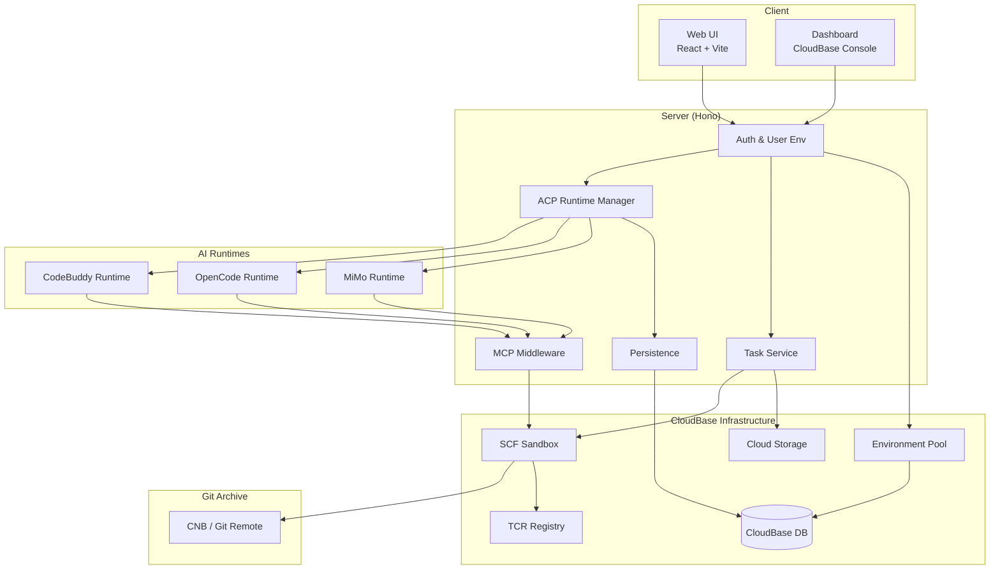
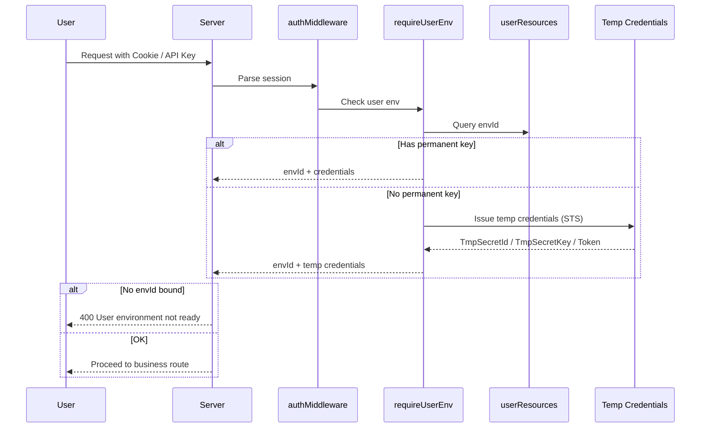
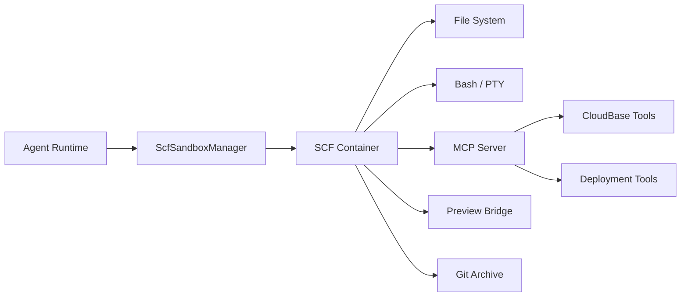
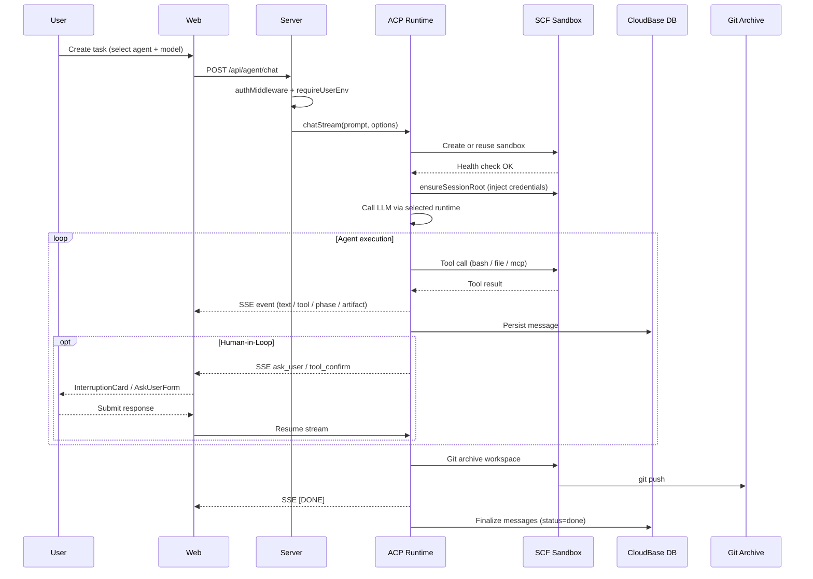
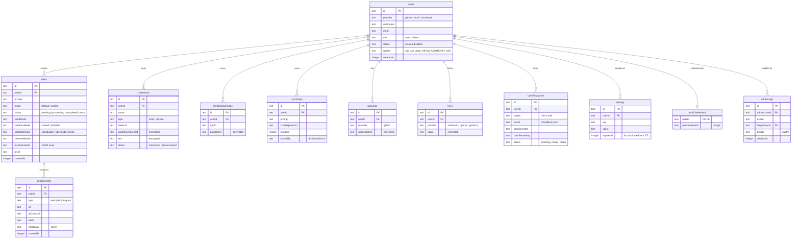

# Architecture

## Overview

CloudBase VibeCoding Platform 是一个基于腾讯云 CloudBase 的 AI 编程助手平台。用户通过 Web 界面向 Agent 下达编程指令，Agent 在隔离的 SCF Sandbox 容器中执行代码操作，结果通过 SSE 流式返回并持久化到 CloudBase 数据库。



## Project Structure

```
packages/
├── web/          # User-facing frontend
├── server/       # API server, agent orchestration, sandbox management
├── dashboard/    # CloudBase resource management console
└── shared/       # Shared types and protocol definitions
```

| Package | Responsibility |
| --- | --- |
| `packages/web` | Task creation, agent chat, log/terminal, PR operations, admin pages |
| `packages/server` | Auth, API routes, agent lifecycle, sandbox, persistence, admin |
| `packages/dashboard` | CloudBase database/storage/functions management UI |
| `packages/shared` | ACP protocol types, task/message schemas, config types |

---

## User Module

用户模块负责身份认证、会话管理和云开发环境分配。

### Authentication

支持多种认证方式，统一通过 JWE 加密 Cookie 维护会话：

| 方式 | 说明 | 入口 |
| --- | --- | --- |
| 本地账密 | 用户名 + bcrypt 密码 | `routes/auth.ts` POST `/register`, `/login` |
| GitHub OAuth | OAuth 2.0 登录或账号关联 | `routes/github-auth.ts` GET `/login`, `/callback` |
| CloudBase 身份 | CloudBase 身份源登录 | `routes/cloudbase-auth.ts` POST `/login` |
| API Key | Bearer `sak_xxx` 头部鉴权 | `middleware/auth.ts` |

### Cloud Environment Binding

认证成功后，系统还需要为用户绑定可用的 CloudBase 环境。这是当前平台的核心边界：



### Environment Provisioning Modes

系统支持三种环境隔离粒度，可在 `/admin/settings` 动态切换（DB 配置优先级高于环境变量默认值）：

| Mode | Description | CAM 行为 |
| --- | --- | --- |
| `shared` | 所有用户共用支撑 CloudBase 环境（默认） | 注册不写 user_resources；middleware 直接用 `TCB_SECRET_ID/KEY` + `TCB_ENV_ID` |
| `isolated` | 每个用户分配独立 CloudBase 环境 | 注册时同步预建 user-level env / CAM / AK / Policy；该用户所有 task 共享此 env |
| `task` | 每个任务独立环境 + 独立 CAM 子账号 | 注册不建；task 创建时同步建独立 env + CAM 子账号 `vibe_t_{taskId}` + AK + Policy |

`requireUserEnv` 中间件按 mode 短路解析，支持 taskId hint / envId hint 三级解析路径。

### Environment Pool

为降低 `isolated` / `task` 模式下的环境获取延迟，系统支持环境池预创建：

- 预创建 CloudBase 环境 + CAM + Policy，获取环境从分钟级降至毫秒级
- 统一生命周期接口 `acquireEnv()` / `releaseEnv()`，屏蔽池化实现细节
- 池空时自动回退实时创建，零停机降级
- 多 Pod 安全：认领使用 CAS 原子操作，补充使用分布式锁（settings 表 TTL 锁）
- 管理后台 `/admin/env-pool`：池配置（开关 + 容量）、实时状态监控、手动补充 / 释放
- 配置存 DB（`env_pool_enabled` / `env_pool_size`），可动态修改无需重启

---

## Agent Module

Agent 模块负责 AI 编程助手的会话管理、模型调用和流式交互。

### ACP Runtime 抽象层

系统通过 `IAgentRuntime` 接口统一多个 AI Agent 运行时，支持并行运行：

| Runtime ID | 实现 | 特点 |
| --- | --- | --- |
| `codebuddy` | `@tencent-ai/agent-sdk` | 支持 Claude、GPT、Gemini、DeepSeek 等；Plan 模式；Subagent 嵌套 |
| `opencode` | OpenCode ACP runtime | 项目级配置隔离（`.opencode/tools/`） |
| `mimo` | MiMo provider | mimo-v2.5-pro（图片理解）、mimo-v2.5、TTS 系列 |

`opencode` 和 `mimo` 共享 `opencode-acp` runtime 实现。

**`GET /api/agent/runtimes`** 返回每个 runtime 的可用状态和模型列表，前端据此驱动 disabled 状态。

切换 agent 时，前端自动校验 `selectedModel` 是否在目标 runtime 的模型列表中，不存在则选第一个。

### ACP Protocol

Agent 通过 ACP (Agent Communication Protocol) 与前端交互，基于 JSON-RPC 2.0：

| Method | Description |
| --- | --- |
| `initialize` | 协议握手，交换版本和能力 |
| `session/new` | 创建新会话 |
| `session/load` | 加载已有会话 |
| `session/prompt` | 发送用户消息，触发 Agent 执行 |
| `session/cancel` | 取消当前执行 |

前端通过 `AcpClient` 类封装所有协议交互：`initializeSession` / `request` / `notify` / `stream`（AsyncIterable）/ `observe`（AsyncIterable）/ `cancel`。网络错误和 5xx 响应会自动指数退避重试。

流式响应通过 SSE (Server-Sent Events) 返回，支持以下事件类型：

| Event | Description |
| --- | --- |
| `text` | Agent 文本输出 |
| `thinking` | 推理过程（discriminator: `'thinking'`） |
| `tool_use` / `tool_result` | 工具调用与结果 |
| `log` | 日志输出 |
| `ask_user` | Agent 向用户提问（触发 Human-in-Loop） |
| `tool_confirm` | 敏感工具调用需用户确认 |
| `agent_phase` | 执行阶段：preparing / model_responding / tool_executing / compacting / idle |
| `artifact` | 结构化产物（部署 URL、小程序二维码、上传结果等） |
| `stop_reason` | 停止原因透传（refusal / max_tokens / error 等） |

服务端在 5 处边界通过 `emitPhase()` helper 发射 `agent_phase` 事件，前端 `AgentStatusIndicator` 按阶段显示对应图标（Rocket / Sparkles / Hammer / Archive）。

### Human-in-Loop（权限模型）

系统实现了四值 `PermissionAction`：`allow` / `allow_always` / `deny` / `reject_and_exit_plan`。

**ToolConfirm 流程：**
1. Agent 调用敏感工具时，服务端发出 `tool_confirm` SSE 事件，流暂停
2. 前端渲染 `InterruptionCard`（消息流内，不打断上下文）
3. 用户点击允许/拒绝后，前端立即本地乐观更新 UI，再发送 resume 请求
4. `sessionPermissions` 维护"本会话始终允许"的工具名白名单，`canUseTool` 命中白名单直接放行

**AskUserQuestion 流程：**
1. Agent 发出 `ask_user` 事件，携带问题和选项
2. 前端渲染内联表单，用户提交后流恢复执行

**Plan 模式：**
- 前端传 `permissionMode: 'plan'`，SDK 切入 Plan 模式
- 除只读工具（Read / Glob / Grep / ExitPlanMode）外，写操作被拦截
- 前端渲染 `PlanModeCard`（三按钮：允许执行 / 继续完善 / 拒绝退出）
- `planModeAtomFamily` 原子跨组件共享 plan 状态

### Memory & Persistence

Agent 消息采用双层持久化：

```
CloudBase DB (vibe_agent_messages)     ← 主存储，跨设备可恢复
  └─ 按 conversationId + userId 索引
Local .jsonl (~/.codebuddy/projects/)  ← 本地备份
  └─ 按 projectHash + sessionId 存储
```

持久化内容包括：用户消息和 Agent 回复、工具调用及其结果、思考过程、AskUserQuestion / ToolConfirm 的交互状态、流式事件（`vibe_agent_stream_events` 集合）。

会话可在中断后恢复：通过 `session/load` 从数据库加载历史记录并重建上下文。刷新后 `InterruptionCard` 从 DB `tool_result.metadata.status === 'incomplete'` 重建。

### Tool Renderers

前端通过 `TOOL_RENDERERS` 注册表为每种工具提供专属渲染器：

- 覆盖工具：Bash / Read / Write / Edit / Grep / Glob / Web / Todo / Task（10 个）
- 每个渲染器提供 `Icon`、`getSummary`、`renderInput`、`renderOutput`
- Edit 渲染器集成 git-diff-view，显示 before/after unified diff
- Default 渲染器剥 MCP 外壳，JSON 参数折叠展开
- DEV 预览页：`/__preview/tool-renderers` 可视化检查所有渲染器效果

### Subagent 嵌套

Agent 调用子 Agent 时，`parent_tool_use_id` 从 SDK 顶层透传至前端 `MessagePart.parentToolCallId`，前端 `SubagentCard` 递归渲染（紫色边框 + Bot 图标 + 子工具数量徽章），支持多层嵌套。

### Cron Tasks

支持定时触发 Agent 执行：
- 创建 / 更新 / 删除 / 启停定时任务，基于 cron 表达式调度
- 服务端 `cron-scheduler.ts` 在启动时加载并按计划触发

---

## Sandbox Module

Sandbox 模块为每个任务 / 会话提供隔离的执行环境。

### Architecture



### SCF Sandbox Lifecycle

1. **Create or Reuse** — `scfSandboxManager` 根据 conversationId 创建或复用云函数容器
2. **Health Check** — 轮询 `/health` 等待容器就绪（进度细分：镜像拉取 → 容器就绪 → 工作区初始化）
3. **Init Workspace** — 通过 `ensureSessionRoot(sessionId)` 注入 CloudBase 凭证和环境变量
4. **Execute** — Agent 通过 HTTP 调用容器内的工具接口
5. **Archive** — 任务结束（包括 error / cancel）时通过 Git 归档工作区

### Workspace Provisioning API

Sandbox 内部使用语义化 Provisioning API 管理工作区层级：

| API | Description |
| --- | --- |
| `ensureSessionRoot(sessionId)` | 确保 session 根目录就绪，不触发 vite 启动 |
| `ensureWorkspaceFor(sessionId, scopeId?, template)` | 确保工作区就绪，可选挂载 Scope |

### Sandbox Capabilities

每个 Sandbox 容器对外暴露以下能力：

| Capability | Endpoint | Description |
| --- | --- | --- |
| File System | `/e2b-compatible/files` | 文件读写（兼容 e2b 协议） |
| Bash | `/api/tools/bash` | Shell 命令执行（PTY） |
| Git Push | `/api/tools/git_push` | 将工作区变更推送到远端 |
| MCP Server | In-memory / HTTP transport | CloudBase 工具和部署工具 |
| Health | `/health` | 容器健康检查 |
| Scope Info | `/api/scope/info` | 子工作区路径和 vite 状态 |

### Scope API（子工作区隔离）

同一 session 内支持多个相互隔离的子工作区：

- 通过请求头 `X-Scope-Id` / `X-Scope-Template` 控制
- 每个 scope 独立运行 vite dev server，端口 5173-5199 动态分配
- `GET /api/scope/info` 返回工作区路径和 vite 状态（`viteState: "starting" | "ready" | "failed"`）
- `spawnVite` 将 tar 解压 + npm install 在 `setImmediate` 中异步执行，HTTP handler 立即返回，不阻塞

### MCP Tool Proxy

Sandbox 内通过 MCP (Model Context Protocol) 向 Agent 提供工具能力。

**CloudBase MCP（内置）** — 全局 CloudBase MCP HTTP server，复用 Express 端口，零额外 TCP 开销；支持 stdio 和 HTTP 两种模式。工具通过 `lib/mcp-middleware/` 的 koa 风格中间件框架进行拦截 / 新增 / 过滤，policy 文件按工具名平铺在 `middleware/mcp/cloudbase/`：

| Policy | Description |
| --- | --- |
| `auth` | 认证鉴权工具 |
| `cronTask` | 定时任务管理 |
| `uploadFiles` | 文件上传（后端签发 STS 临时凭证） |
| `publishMiniprogram` | 小程序构建与发布 |
| `downloadTemplate` | 模板下载 |
| `getDeployJobStatus` | 部署任务状态查询 |
| ... | 共 13 个 policy |

**用户自定义连接器** — 用户可配置额外的 MCP Server（`local` 进程 / `remote` HTTP），在任务执行时注入 Agent。支持 OAuth 认证和环境变量注入，敏感数据加密存储。

### Preview Bridge

Preview iframe 通过 `usePreviewBridge` hook 与父页面通信：
- 封装事件监听 + 指令发送 + RPC（`bridge.ping` health check）
- BrowserControls 改用 postMessage 指令，替代 `contentWindow.history` API
- 新增 HMR 状态指示灯、URL 同步
- vite 配置自动 patch：`hmr: { clientPort: 443, protocol: 'wss' }` 适配 CloudBase gateway

### Workspace Persistence (Git Archive)

工作区变更通过 Git 持久化到远端仓库：

```
Git Remote (GIT_ARCHIVE_REPO)
├── branch: {envId}
│   ├── {conversationId-1}/
│   │   ├── src/
│   │   └── package.json
│   └── {conversationId-2}/
│       └── ...
```

- **分支策略**：每个用户环境 (`envId`) 对应一个分支
- **目录策略**：每个会话 (`conversationId`) 对应分支下的一个目录
- **归档时机**：任务结束时（含 error / cancel），在 `finally` 块中执行
- **清理方式**：通过 CNB Gateway API 删除远端目录或分支

---

## Artifact & Deployment Module

所有 Agent 产出统一通过 `artifact` SSE 事件传递，同时创建 deployment 记录持久化到数据库。

```typescript
interface Artifact {
  title: string
  description?: string
  contentType: 'image' | 'link' | 'json'
  data: string
  metadata?: Record<string, unknown>
}
```

| 部署类型 | 触发方式 | Artifact contentType |
| --- | --- | --- |
| Web 静态托管 | `uploadFiles` 工具检测到静态托管 URL | `'link'` |
| 微信小程序 | MCP 工具 `publishMiniprogram` | `'image'`（预览二维码）/ `'json'`（上传结果） |
| 图片生成 | Default 模式 ImageGen tool | `'link'`（CDN URL） |

小程序部署超过 60s 时接口异步返回 `{ async: true, jobId }`，客户端轮询 `GET /api/miniprogram/deploy/:jobId` 获取实时构建日志。

前端 Deployments 标签页统一渲染所有 deployment 记录，根据字段自动选择卡片样式（链接卡片 / 二维码卡片 / 通用卡片）。

---

## CloudBase Dashboard

task 详情页内嵌 CloudBase 资源管理 Dashboard，envId/taskId 通过 Context 强制参数化，所有请求自动携带 `?envId=` 与 `X-Task-Id`。

---

## Admin Module

管理后台提供平台治理能力，仅限 `role=admin` 的用户访问（`requireAdmin` 中间件保护）。

| Feature | Description |
| --- | --- |
| User Management | 用户列表、创建、禁用 / 启用、角色设置、密码重置、API Key 管理 |
| Task Inspection | 全量任务查看、按用户筛选、消息详情 |
| Environment Settings | provision mode 切换、环境池配置 |
| Environment Pool | `/admin/env-pool`：实时状态监控、手动补充 / 释放 |
| Resource Proxy | 按 envId 代理访问 database / storage / functions / capi |
| Audit Log | 管理员操作日志记录与查询 |

管理员操作记录到 `adminLogs` 表，包含操作类型、目标用户、IP 和 User-Agent。代理访问用户环境时使用系统级凭证，不继承用户凭证。

---

## Data Flow

一次完整的任务执行流程：



---

## Technology Stack

| Layer | Technology |
| --- | --- |
| Frontend | React 19, Vite, Tailwind CSS 4, shadcn/ui, Jotai |
| Backend | Hono, Node.js, Drizzle ORM |
| Database | CloudBase DB (primary), SQLite (local fallback) |
| AI | `@tencent-ai/agent-sdk` (CodeBuddy), OpenCode ACP, MiMo |
| Sandbox | CloudBase SCF, TCR container images |
| Auth | JWE session, bcrypt, Arctic (OAuth) |
| Persistence | CloudBase DB, local .jsonl, Git archive |
| Protocol | ACP (JSON-RPC 2.0 + SSE), MCP (Model Context Protocol) |

---

## API Routes

所有 API 路由挂载在 `packages/server/src/index.ts`，全局应用 `authMiddleware`。

| Route | Module | Auth | Description |
| --- | --- | --- | --- |
| `GET /health` | inline | None | 健康检查 |
| `/api/auth/*` | `routes/auth.ts` | None / Cookie | 注册、登录、登出、用户信息、API Key |
| `/api/auth/github/*` | `routes/github-auth.ts` | Cookie | GitHub OAuth 登录、回调、关联、断开 |
| `/api/auth/cloudbase/*` | `routes/cloudbase-auth.ts` | None | CloudBase 身份登录 |
| `/api/agent/*` | `routes/acp.ts` | Cookie + UserEnv | ACP 协议、会话 CRUD、SSE chat、消息记录 |
| `/api/tasks/*` | `routes/tasks.ts` | Cookie + UserEnv | 任务 CRUD、文件操作、PR 管理、Sandbox 命令 |
| `/api/github/*` | `routes/github.ts` | Cookie | GitHub 用户、仓库、组织 |
| `/api/repos/*` | `routes/repos.ts` | Cookie | 仓库 commits / issues / PRs 查询 |
| `/api/connectors/*` | `routes/connectors.ts` | Cookie | MCP 连接器 CRUD |
| `/api/miniprogram/*` | `routes/miniprogram.ts` | Cookie | 小程序应用管理、部署轮询 |
| `/api/crontask/*` | `routes/crontask.ts` | Cookie | 定时任务 CRUD |
| `/api/api-keys/*` | `routes/api-keys.ts` | Cookie | 用户 API Key 管理 |
| `/api/database/*` | `routes/database.ts` | Cookie + UserEnv | CloudBase 集合与文档操作 |
| `/api/storage/*` | `routes/storage.ts` | Cookie + UserEnv | CloudBase 文件管理、上传凭证签发 |
| `/api/functions/*` | `routes/functions.ts` | Cookie + UserEnv | CloudBase 云函数列表与调用 |
| `/api/sql/*` | `routes/sql.ts` | Cookie + UserEnv | SQL 查询 |
| `/api/capi` | `routes/capi.ts` | Cookie + UserEnv | 通用腾讯云 API 代理 |
| `/api/admin/*` | `routes/admin.ts` | Cookie + Admin | 用户管理、任务巡检、环境代理、审计日志、环境池 |
| `/api/sandboxes` | `routes/misc.ts` | Cookie + UserEnv | 活跃 Sandbox 列表 |

**Auth 列说明：**
- **None** — 无需认证
- **Cookie** — 需要登录（`requireAuth`）
- **Cookie + UserEnv** — 需要登录且用户环境已绑定（`requireUserEnv`）
- **Cookie + Admin** — 需要登录且 `role=admin`（`requireAdmin`）

---

## Database Schema

数据模型定义在 `packages/server/src/db/schema.ts`，使用 Drizzle ORM。CloudBase 模式下使用 CloudBase 文档数据库（集合名带 `vibe_agent_` 前缀），Drizzle 模式下使用 SQLite。



### CloudBase 专有集合

除上述表结构外，Agent 消息持久化使用 CloudBase 文档数据库的两个集合：

| Collection | Description |
| --- | --- |
| `vibe_agent_messages` | Agent 会话消息记录（按 conversationId + userId 索引） |
| `vibe_agent_stream_events` | SSE 流式事件（按 conversationId + turnId + seq 索引，用于回放） |

---

## Security Model

### Credential Encryption

所有敏感数据在入库前使用 AES-256-CBC 加密（`lib/crypto.ts`）：

| Data | Storage |
| --- | --- |
| GitHub Access Token | `accounts.accessToken` — 加密存储 |
| MCP Connector OAuth Secret | `connectors.oauthClientSecret` — 加密存储 |
| MCP Connector Env Vars | `connectors.env` — 加密存储 |
| 小程序私钥 | `miniprogramApps.privateKey` — 加密存储 |
| 用户 AI API Keys | `keys.value` — 加密存储 |
| 本地用户密码 | `localCredentials.passwordHash` — bcrypt 哈希 |
| 用户 API Key | `users.apiKey` — 明文存储（`sak_xxx`，DB 层有 ADMINONLY 安全规则保护，可吊销） |

加密密钥通过 `ENCRYPTION_KEY` 环境变量配置（32 字节 hex），init 脚本自动生成。

### Session Security

- 会话通过 JWE (JSON Web Encryption) 加密存储在 HttpOnly Cookie 中
- 加密密钥为 `JWE_SECRET`（base64 编码），init 脚本自动生成
- Cookie 名称：`nex_session`

### CloudBase Credential Isolation

- 系统级密钥（`TCB_SECRET_ID` / `TCB_SECRET_KEY`）仅用于支撑环境操作
- 用户级操作通过 STS 签发临时凭证，scope 限定在用户自己的 `envId` 内
- 临时凭证内存缓存，cache key 为 `userId:envId`（含 envId 避免跨环境拿错 token）
- `task` 模式下每个 task 独立 CAM 子账号 `vibe_t_{taskId}`，避免密钥轮换影响其他 task
- 上传文件使用后端签发的 STS 临时凭证（`POST /api/storage/upload-credential`），规避子账号 GetFederationToken 限制
- Git remote URL 不嵌入 token，改用内存 credential helper 在 push/fetch 时动态注入

### CloudBase Database Security

所有系统集合（users / tasks / keys 等）在首次访问时自动通过 `ModifySafeRule(AclTag=ADMINONLY)` 设为管理员专用，阻止前端 Web SDK 直接读写。

### Log Security

所有日志输出必须使用静态字符串，禁止包含动态值（详见 `AGENTS.md`）。`redactSensitiveInfo()` 函数作为二级防护，自动脱敏已知敏感模式。

### Resource Destruction Safety

`destroyProvisionedResources` 返回 `{ steps, failed }`，NotFound 类错误视为幂等成功；资源未清完时返回 409，DB row 保留可重试（如 env "云存储域名尚在初始化中" 场景）。

---

## Related Documents

- [Setup Guide](./setup.md) — 初始化流程、环境变量、验证与排障
- [SCF Session Sharing](./scf-session-sharing.md) — 沙箱会话共享方案
- [Cron Task Plan](./crontask-cloudfunction-plan.md) — 定时任务云函数演进规划
- [ACP Runtime Abstraction](./acp-runtime-abstraction.md) — ACP Runtime 抽象层设计
