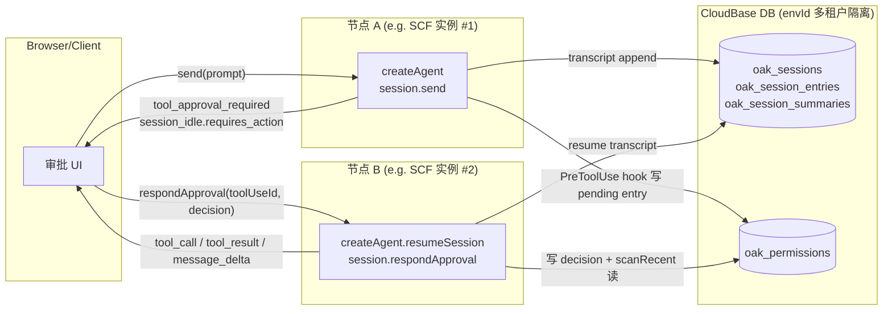

# @cloudbase/open-agent-kernel

> 给 CloudBase 平台开发者用的服务端 agentic agent SDK
> 开箱集成 CloudBase 数据库 / 存储 / 沙箱 / 模型网关 / 凭证

## 状态

🚧 **v0.1.0-alpha.0 — 分布式 HITL 阶段（PR #7.1）**

已接通：
- 公共类型契约（`AgentConfig` / `SessionEvent` / `Session` / `Agent` 等）
- Runtime 薄封装 Claude Agent SDK（envId / model → ANTHROPIC_BASE_URL / ANTHROPIC_AUTH_TOKEN）
- 资源派生（`resources/`：envId → CloudBase DB 集合名 / SCF 沙箱函数名 / 模型网关 baseURL）
- 凭证加载（从 `process.env.TENCENTCLOUD_TOKENHUB_API_KEY` 或用户直传）
- 事件翻译（SDK SDKMessage → kernel SessionEvent，含错误路径）
- **会话持久化（PR #4）**
- **多模态输入（PR #4.5）**
- **MCP 接入（PR #5）**：`AgentConfig.mcpServers` 完全对齐 Claude SDK 4 种形态
- **Sandbox 接入（PR #6A + #6B + #6C）**：腾讯云 Agent Sandbox 产品（AGS Stateful Sandbox）
  - `AgsStatefulSandbox` runtime（控制面 AGS OpenAPI + 数据面 TRW HTTP gateway）
  - 自动暴露 6 个工具给 agent（`mcp__sandbox__*`），**全部直调 TRW `/api/tools/{name}` 原生端点**（PR #6C），schema 与 opencode / Claude Code builtin 对齐：
    - `bash` / `read` / `write`
    - `edit`（支持 `replaceAll`）/ `glob`（支持 `**` 多段通配）/ `grep`（支持 `glob` 文件过滤）
  - 实例 lazy acquire（startSession 不阻塞，第一次 send 时启动沙箱）
  - **两种实例粒度**：
    - `session`（默认）：每个 session 一个独立实例，session.abort 时 Pause
    - `shared`（PR #6B）：同 envId 多 session 共享一个实例，按需 Resume / Stop 漂移实例
- **CloudBase 内置 MCP（PR #6.5）**：开通 sandbox 即自动暴露 cloudbase 工具集
  - 沙箱启动后自动注入用户租户凭证（`PUT /api/workspace/env`）
  - 沙箱内 `mcporter list cloudbase --schema` 发现工具集（DB / COS / 云函数 / 静态托管 / …，约 36 个工具）
  - JSON Schema → zod 转换 → `mcp__cloudbase__*` 工具暴露给 agent
  - 凭证错误自动检测 + re-inject + 重试一次
  - degraded 模式：schema 拉取失败时不阻塞 session 启动，agent 仍能用 sandbox 工具
- **HITL 工具审批（PR #7.0）**：协议无关、为分布式扩展铺好范式
  - `permissions.requireApproval`：通配符 / 数组 / 函数式规则
  - `session.respondApproval({ toolUseId, decision })`：注入决策并恢复 agent 运行
  - `ApprovalDecision` 协议无关超集：`{ kind: 'allow' | 'deny', scope?, reason?, updatedInput?, interrupt? }`
  - `PermissionStore` 接口 + `InMemoryPermissionStore` 默认开箱即用，业务可自实现做分布式
  - 设计上不走 SDK 原生 `canUseTool`（绑死单进程），改用 PreToolUse Hook + 流终止 + resume 范式（OpenAI Agents SDK / LangGraph 同款）
- **分布式审批（PR #7.1）**：`send` 与 `respondApproval` 可跨节点 / 跨进程 / 跨设备
  - `CloudBasePermissionStore` + `CloudBaseDbPermissionDriver`：审批状态落 CloudBase DB
  - `projectKey: envId` 做多租户隔离，与 `CloudBaseSessionStore` 同集合前缀（`oak_`）
  - Driver 模式与 `SessionStoreDriver` 同构（业务侧可自实现 Postgres / Redis driver）
  - `oak_permissions` 单集合 + `scanRecent` 兜底路径，无需 Redis
- 最小可运行 examples：
  - `01-quickstart.ts` 单轮对话
  - `03-multi-turn.ts` 多轮对话 + InMemorySessionStore
  - `04-multi-turn-db.ts` 多轮对话 + CloudBaseDbDriver（生产）
  - `05-multimodal.ts` 图片输入 + 视觉模型（glm-5v-turbo）
  - `06-mcp-sdk-server.ts` 进程内 SDK MCP server
  - `07-mcp-stdio.ts` stdio 接入社区 MCP server
  - `08-sandbox.ts` AGS Stateful Sandbox 端到端（isolated 模式，bash/read/write）
  - `09-sandbox-shared.ts` Sandbox shared 模式 + edit/glob/grep 扩展工具
  - `10-sandbox-cloudbase-tools.ts` 内置 CloudBase MCP（mcp__cloudbase__*）端到端
  - `11-hitl-approval.ts` HITL 端到端（CLI 交互拿用户决策 → respondApproval → 流继续）
  - `12-hitl-acp-adapter.ts` ACP 协议适配演示（kernel HITL 事件 ↔ ACP `session/request_permission`）
  - `13-hitl-distributed-cloudbase.ts` 分布式 HITL 端到端（节点 A `send` → 节点 B `respondApproval`，共享 CloudBase DB）

未接通（后续 PR）：
- PR #8：handoffs / subagent 接入
- 业务层职责（不进 kernel）：
  - preview 反向代理：kernel 是纯库，HTTP middleware / WebSocket 反代留给业务自家 server 实现
  - cron 定时任务、artifact 持久化、小程序发布：依赖业务 DB / UI / 私钥存储，由业务通过 PR #5 `mcpServers` 注入

## 设计原则

1. **5 分钟上手**：纯 npm 库 import，零环境配置（除 envId 外全部按规则派生）
2. **agentic 完整**：基于 Claude Agent SDK（Anthropic 官方），plan / subagent / skills / compaction / memory / 19 种 hooks 全部自带
3. **CloudBase 资源开箱即用**：envId 锚定，自动接入数据库 / 沙箱 / 网关 / 凭证
4. **协议中立**：kernel 公开 API 不绑客户端协议，事件流由用户接 ACP / AG-UI / 自定义 SSE
5. **真纯库**：服务端任意运行时（HTTP 函数 / 容器 / 主机），无 spawn 子进程依赖

## 形态

```
┌──────────────────────────────────────────────────────────────────┐
│ User business code (CloudBase 开发者)                              │
│   import { createAgent } from '@cloudbase/open-agent-kernel'      │
└────────────────────────┬─────────────────────────────────────────┘
                         │
┌────────────────────────▼─────────────────────────────────────────┐
│ @cloudbase/open-agent-kernel                                      │
│   - public/    类型 + createAgent + Agent + Session               │
│   - runtime/   薄封装 Claude Agent SDK                             │
│   - resources/ envId 派生 + 凭证                                   │
│   - session-store/ 实现 SDK SessionStore 协议（CloudBase DB）       │
│   - sandbox/   把沙箱工具包装为 SDK MCP server（CloudBase SCF）     │
│   - mcp/       内置 CloudBase MCP server                            │
└────────────────────────┬─────────────────────────────────────────┘
                         │
            ┌────────────┴────────────┐
            ▼                         ▼
   @anthropic-ai/claude-agent-sdk    CloudBase APIs
   (Anthropic 官方, agentic harness) (DB / Sandbox / Gateway / IAM)
```

## 使用预览

```ts
import { createAgent } from '@cloudbase/open-agent-kernel'

const agent = createAgent({
  envId: 'my-env-123',
  // 当前阶段走腾讯云 TokenHub（https://tokenhub.tencentmaas.com）的 Anthropic 协议
  // 等 CloudBase 网关 Anthropic 协议上线后会自动切换，model 字符串不变
  model: 'glm-5.1',
  systemPrompt: 'You are a helpful CloudBase assistant.',
})

const session = await agent.startSession({ userId: 'user-1' })

for await (const event of session.send('你好，请用一句话介绍你自己。')) {
  if (event.type === 'message_delta') {
    process.stdout.write(event.text)
  }
}
```

## 凭证配置

当前阶段使用腾讯云 TokenHub 的 Anthropic 协议端点，需要一个 API Key：

1. 在腾讯云控制台 [TokenHub](https://console.cloud.tencent.com/tokenhub) → API Key 管理创建一个 Key
2. 配置环境变量：

   ```bash
   export TENCENTCLOUD_TOKENHUB_API_KEY=sk-xxxxxxxxxxxxx
   # 或过渡期兼容名：export CLOUDBASE_API_KEY=sk-xxxxxxxxxxxxx
   ```

   或在代码中直传：

   ```ts
   createAgent({
     envId: 'my-env-123',
     model: { id: 'glm-5.1', apiKey: 'sk-...' },
   })
   ```

> **未来切换说明**：等 CloudBase 网关 Anthropic 协议完全上线后，凭证派生会自动转为 envId → CloudBase 临时凭证，**用户代码零改动**。

## 会话持久化（PR #4）

不传 `session.store`：transcript 在 SDK 子进程退出后丢失（适合一次性脚本）。
传 `session.store`：transcript 镜像到外部存储，**支持多轮对话和跨节点 resume**。

### 用 InMemoryDriver（测试 / 本地 demo）

```ts
import {
  createAgent,
  CloudBaseSessionStore,
  InMemoryDriver,
} from '@cloudbase/open-agent-kernel'

const envId = 'my-env'
const driver = new InMemoryDriver()
const store = new CloudBaseSessionStore({ driver })

const agent = createAgent({
  envId,
  model: 'glm-5.1',
  session: { store },
})

const session = await agent.startSession({ userId: 'u1' })
// 多轮对话自动共用 transcript
for await (const e of session.send('我叫小明')) { /* ... */ }
for await (const e of session.send('还记得我的名字吗？')) { /* ... */ }
```

### 用 CloudBaseDbDriver（生产，落 CloudBase 数据库）

需要平台支撑密钥（与 OpenVibeCoding 项目惯例一致）：

```bash
export TCB_ENV_ID=my-env
export TCB_SECRET_ID=AKIDxxx
export TCB_SECRET_KEY=xxx
```

```ts
import {
  createAgent,
  CloudBaseSessionStore,
  CloudBaseDbDriver,
} from '@cloudbase/open-agent-kernel'

const envId = 'my-env'
const driver = new CloudBaseDbDriver({
  collectionPrefix: 'oak_', // 默认值，按需自定义
})
const store = new CloudBaseSessionStore({
  driver,
  projectKey: envId, // 强烈建议：以 envId 做命名空间隔离（详见下方）
})

const agent = createAgent({
  envId,
  model: 'glm-5.1',
  session: { store },
})

// 跨节点 resume：业务侧只需持久化 conversationId（一个 UUID）
const session1 = await agent.startSession({ userId: 'u1' })
const conversationId = session1.id

// ... 业务把 conversationId 落 DB / Cookie ...
// ... 之后任意节点 / 新进程 ...

const session2 = await agent.resumeSession(conversationId)
// session2 自动从 store 加载历史，继续对话
```

### 关于 `projectKey: envId`

Claude Agent SDK 内部用 cwd 派生 `SessionKey.projectKey`（"sanitized cwd"），这在 server-side 部署里有两个真实问题：

1. **多环境 cwd 漂移**：本地开发 cwd 是 `/Users/dev/proj`，生产容器是 `/var/task` —— 同一 sessionId 在不同 projectKey 下，跨节点 resume 断裂
2. **多租户隔离**：同一进程服务多个 envId 时所有租户共享同一 cwd —— 隔离失效

构造 store 时传 `projectKey: envId`，所有 store 操作的 projectKey 替换为 envId，问题彻底解决。本地单机开发可不传（保持 SDK 默认行为）。

### 集合 schema

| 集合 | 字段 | 用途 |
|---|---|---|
| `oak_sessions` | `projectKey, sessionId, mtime, createdAt` | listSessions 索引 |
| `oak_session_entries` | `sessionKey, projectKey, sessionId, subpath, seq, uuid, type, entry, createdAt` | transcript 全量条目 |
| `oak_session_summaries` | `projectKey, sessionId, mtime, data` | session 摘要（SDK foldSessionSummary 维护） |

uuid 字段做幂等键（SDK 重试 / replay 时不重复插入）。

## 多模态输入（PR #4.5）

支持图片附件，配合视觉模型（如 `glm-5v-turbo`）做图片理解。

### 用 InMemoryStorage（本地开发）

```ts
import { createAgent, InMemoryStorage } from '@cloudbase/open-agent-kernel'

const agent = createAgent({
  envId: 'my-env',
  model: 'glm-5v-turbo', // 视觉模型
  storage: new InMemoryStorage(), // 图片读为 Buffer → base64 → SDK
})

const session = await agent.startSession({ userId: 'u1' })

for await (const e of session.send({
  type: 'message',
  content: '这张图里展示了什么？',
  attachments: [{ type: 'file', source: './screenshot.png' }],
})) {
  if (e.type === 'message_delta') process.stdout.write(e.text)
}
```

### 用 CloudBaseStorage（生产）

```ts
import { createAgent, CloudBaseStorage } from '@cloudbase/open-agent-kernel'

const agent = createAgent({
  envId: 'my-env',
  model: 'glm-5v-turbo',
  // 图片上传到 CloudBase 云存储 → 模型用临时签名 URL 引用
  // 凭证同 CloudBaseDbDriver：TCB_ENV_ID + TCB_SECRET_ID + TCB_SECRET_KEY
  storage: new CloudBaseStorage({
    pathPrefix: 'agent-attachments/', // 默认值
    urlExpiresIn: 3600, // 签名 URL 有效期（秒）
  }),
})
```

### 三种附件类型

```ts
attachments: [
  // 1. 本地文件路径
  { type: 'file', source: '/abs/path/to/image.png' },

  // 2. 内存 Buffer
  { type: 'file', source: someBuffer, mimeType: 'image/png' },

  // 3. 已有公网 URL（kernel 不下载，直接透传）
  { type: 'url', url: 'https://example.com/cat.jpg' },

  // 4. 已存在 CloudBase 云存储里的 fileId（仅 CloudBaseStorage 支持）
  { type: 'cos', fileId: 'cloud://my-env.xxx/path/to/file.png' },
]
```

### 支持的图片格式

仅 Anthropic 协议接受的 4 种：`image/jpeg` / `image/png` / `image/gif` / `image/webp`。
其他格式 kernel 直接抛 `StorageError`。

### transcript 历史中的图片引用

`MessagePart.image.ref` 字段保存稳定引用：
- `cos`：`{ kind: 'cos', fileId: 'cloud://...' }` —— 生产推荐，长期稳定
- `base64`：`{ kind: 'base64', dataUrl: 'data:image/png;base64,...' }` —— 自包含
- `url`：`{ kind: 'url', url: 'https://...' }` —— 外部 URL（kernel 不保证有效期）

读取历史时调 `storage.resolveRefToUrl(ref)` 按需重新生成可访问 URL。

## MCP 工具接入（PR #5）

`AgentConfig.mcpServers` **完全对齐 Claude Agent SDK 的 `McpServerConfig`**——4 种形态全部支持，kernel 不做改写不做封装，纯透传。

```ts
mcpServers?: Record<string, McpServerConfig>
```

### 形态 1：进程内 SDK server（推荐用于自定义工具）

零外部依赖，工具实现就是普通 TS 函数，凭证 / 上下文跟 kernel 共享：

```ts
import { createSdkMcpServer, tool } from '@anthropic-ai/claude-agent-sdk'
import { z } from 'zod'
import { createAgent } from '@cloudbase/open-agent-kernel'

const calculator = createSdkMcpServer({
  name: 'calculator',
  version: '1.0.0',
  tools: [
    tool('add', 'Add two numbers', { a: z.number(), b: z.number() }, async (args) => ({
      content: [{ type: 'text', text: String(args.a + args.b) }],
    })),
  ],
})

const agent = createAgent({
  envId: 'my-env',
  model: 'glm-5.1',
  mcpServers: { calculator }, // key 即 server name
})
```

模型最终看到的工具名为 `mcp__calculator__add`（SDK 自动加前缀）。

### 形态 2：stdio 子进程（接入 npm 上的 MCP 包）

```ts
const agent = createAgent({
  envId: 'my-env',
  model: 'glm-5.1',
  mcpServers: {
    everything: {
      type: 'stdio',
      command: 'npx',
      args: ['-y', '@modelcontextprotocol/server-everything'],
      // env?: 透传给子进程的环境变量
    },
  },
})
```

> ⚠️ stdio 模式要求宿主有 Node 环境 + 网络（npx 拉包）。云函数等场景**不推荐**，请优先用进程内 SDK server 形态。

### 形态 3 / 4：远程 HTTP / SSE

```ts
mcpServers: {
  remote: {
    type: 'http',          // 或 'sse'（已弃用）
    url: 'https://example.com/mcp/v1',
    headers: { Authorization: 'Bearer xxx' },
  },
}
```

### 安全性约定

社区 MCP（stdio / http / sse）的执行动作（如读写本地文件、调用第三方 API）**由用户自己负责**——kernel 透传配置，不做安全过滤。

**当前默认权限策略**（PR #5 阶段）：

注入 `mcpServers` 后 kernel 默认开启 `permissionMode: 'bypassPermissions'`——所有工具调用直接放行，不需要审批。理由是用户既然显式注入了 server 就是信任它，且 SDK 内置危险工具（Bash / Edit / Write 等）已经被 kernel 整个禁用，bypass 实际只放行用户主动注入的部分。

**PR #7 将接入 HITL**（`canUseTool` / `requireApproval`），届时传 `permissions` 字段会自动关闭 bypass、走精细化权限决策。

### CloudBase 官方 MCP？

CloudBase 官方 MCP 工具集（数据库 / 存储 / 云函数 / 静态托管 / ...）暂未作为内置能力提供。原因：其中部分工具（如静态托管上传）涉及本地文件操作，需要先接入沙箱（PR #6）后才能安全地放进 kernel。在那之前，用户需要时可以**自己用 stdio 形态接入** `@cloudbase/cloudbase-mcp`，安全/凭证由用户自行承担。

## Sandbox 接入（PR #6A + #6B + #6C）

接入腾讯云 **Agent Sandbox 产品**（AGS Stateful Sandbox），让 agent 在隔离的远程容器里跑文件系统 / shell：

```ts
import { createAgent, AgsStatefulSandbox } from '@cloudbase/open-agent-kernel'

const agent = createAgent({
  envId: 'my-env',
  model: 'glm-5.1',
  systemPrompt:
    'You are a coding assistant. Use the bash / read / write / edit / glob / grep tools to interact with the filesystem.',
  sandbox: {
    runtime: new AgsStatefulSandbox(),
    // 'session'（默认）= 每个 startSession 一个独立 AGS 实例
    // 'shared'         = 同 envId 多 session 共享一个实例
    scope: 'session',
  },
})

const session = await agent.startSession({ userId: 'u1' })
for await (const e of session.send('帮我创建一个 README.md 然后跑 ls')) {
  if (e.type === 'message_delta') process.stdout.write(e.text)
  if (e.type === 'tool_call') console.log('→', e.toolName)
}
await session.abort() // session 模式：触发 PauseSandboxInstance；shared 模式：no-op
```

### 暴露给 agent 的工具

PR #6C 起，所有工具直接调用 TRW 镜像内置的 `POST /api/tools/{name}` 端点，
schema 与 opencode v1.14.33 / Claude Code builtin 对齐——单次 HTTP 完成、
exact-once / 多段通配 / 文件编码等语义由 TRW 服务端实现。

| 工具 | TRW 端点 | 关键参数 |
|---|---|---|
| `mcp__sandbox__bash` | `POST /api/tools/bash` | `command`, `timeoutMs?` |
| `mcp__sandbox__read` | `POST /api/tools/read` | `path`, `offset?`（0-based 行号）, `limit?`（最大行数） |
| `mcp__sandbox__write` | `POST /api/tools/write` | `path`, `content`（自动 mkdir parent，覆盖写入） |
| `mcp__sandbox__edit` | `POST /api/tools/edit` | `path`, `oldString`, `newString`, `replaceAll?`（默认 false，要求 oldString 出现一次） |
| `mcp__sandbox__glob` | `POST /api/tools/glob` | `pattern`（支持 `**` 多段通配）, `path?` |
| `mcp__sandbox__grep` | `POST /api/tools/grep` | `pattern`（regex）, `path?`, `glob?`（文件名过滤，如 `"*.ts"`） |

### 实例粒度（scope）

**`session`（默认）**：

- 每个 `agent.startSession()` 调一次 `StartSandboxInstance`，拿到独立实例
- `session.abort()` 自动 `PauseSandboxInstance`（释放资源 + 保留状态）
- **适用**：任务间需要完全隔离的场景（多用户互不影响）

**`shared`**：

- `acquire` 时 `DescribeSandboxInstanceList` 找 RUNNING/PAUSED 的实例复用
- PAUSED 的先 `ResumeSandboxInstance` 再用
- 同 envId 下多余的 active 实例 best-effort `StopSandboxInstance`（避免漂移）
- `session.abort()` **不** pause（其他 session 可能还在用），由 AGS 按 `DefaultTimeout` 自动回收
- **适用**：同 envId 多 session 共享工作区的场景（如 IDE 多 tab、长时任务接力）

### 凭证配置

| 用途 | 环境变量 | 必需 |
|---|---|---|
| 数据面认证（TRW HTTP gateway 的 Bearer token） | `TCB_API_KEY`（长期 JWT） | ✅ |
| 控制面 AK | `TCB_SECRET_ID` / `TENCENTCLOUD_SECRET_ID` / `TENCENT_SECRET_ID` | ✅ |
| 控制面 SK | `TCB_SECRET_KEY` / `TENCENTCLOUD_SECRET_KEY` / `TENCENT_SECRET_KEY` | ✅ |
| 临时 token | `TCB_TOKEN` / `TENCENTCLOUD_SESSIONTOKEN` | ❌ |
| envId | `TCB_ENV_ID`（同 PR #4） | ✅ |
| 镜像覆盖 | `OAK_SANDBOX_IMAGE` | ❌（不传走默认 OpenVibeCoding 公开 TCR 镜像） |

### 内置 CloudBase MCP 工具集（PR #6.5）

开通 sandbox 后默认自动暴露 `mcp__cloudbase__*` 工具集（数据库 / 存储 / 云函数 / 静态托管 / 知识库 / …，约 36 个），让 agent 能直接操作 CloudBase 资源——**无需用户手动注入 cloudbase-mcp**。

```ts
const agent = createAgent({
  envId: 'my-env',
  model: 'glm-5.1',
  sandbox: {
    runtime: new AgsStatefulSandbox(),
    // 默认 cloudbaseTools: true（开通 sandbox 即自动内置 cloudbase MCP）
    // 显式关闭：cloudbaseTools: false

    // 多租户场景：每次 acquire 调一次拿当前用户的凭证
    userCredentials: async () => {
      const u = await myDb.getUserCloudbaseCreds(currentUserId)
      return { envId: u.envId, secretId: u.secretId, secretKey: u.secretKey }
    },
    // 单租户/本地开发：直接传对象
    // userCredentials: { secretId: '...', secretKey: '...' }
    // 不传 → 回退到 process.env.TCB_SECRET_ID/KEY 兜底
  },
})
```

**用户租户凭证 vs 平台控制面凭证**：

| 凭证 | 用途 | 来源 |
|---|---|---|
| 平台凭证（`TCB_SECRET_ID/KEY` + `TCB_API_KEY`） | 起 / 暂停沙箱实例（AGS 控制面）+ 数据面 Bearer | `process.env`，由平台持有 |
| 用户租户凭证（`SandboxConfig.userCredentials`） | 沙箱内 cloudbase-mcp 操作 DB / COS / 云函数等 | 业务回调动态获取，可与平台凭证不同 |

不传 `userCredentials` 时回退到 `process.env.TCB_SECRET_ID/KEY`（适合本地开发）；既无回调又无环境变量时 cloudbase 工具会 throw `InvalidConfigError`，提示明确。

**自动重试机制**：当 cloudbase 工具返回 `AUTH_REQUIRED` / `SecretId is not found` / `InvalidParameter.SecretIdNotFound` / `AuthFailure` 时，kernel 自动重新调 `userCredentials()` 拿最新凭证写回沙箱环境变量（`PUT /api/workspace/env`），然后重试一次。失败再次时把 stdout 原样交给模型。

**镜像约束**：cloudbase MCP 依赖镜像内置的 mcporter + `@cloudbase/cloudbase-mcp`（默认 OpenVibeCoding `tcb-sandbox-public-cbe88d:...vibecoding` 镜像满足）。镜像不带这两个工具时 schema 拉取失败 → degrade 到 0 个 cloudbase 工具，**不阻塞 session 启动**，agent 仍能用 `mcp__sandbox__*` 文件系统/shell 工具。

**工具范围（kernel 内置）**：
- ✅ 通用 cloudbase 工具：DB 增删改查 / COS 上传下载 / 云函数列表 / 静态托管 / 知识库检索 / …
- ❌ **不含**（业务层职责）：
  - `cron` 定时任务（依赖业务 DB + 调度器单例）
  - `publishMiniprogram`（依赖业务私钥存储）
  - `login`（用自动重试机制代替）
  - `logout` / `interactiveDialog`（与凭证注入冲突 / 依赖业务 UI）
  - artifact 持久化（依赖业务 UI 协议）

业务侧需要这些能力时，按 PR #5 的 `mcpServers` 协议注入即可。

### 生命周期

- **lazy acquire**：`startSession()` 不阻塞，第一次 `session.send()` 时才真正启动沙箱（首次 ~30-60s 含 warmup）
- 同一 envId 的 ToolId 在进程内 cache（避免重复 ensure）
- 新建 Tool 后死等 60s 镜像 warmup，避免立即 StartSandboxInstance 报 "is not active"
- StartSandboxInstance 遇到可重试错误（`is not active` / `CREATING` / `InternalError` / `ResourceInsufficient`）自动 10s × 6 轮重试

### 架构（参考）

```
kernel 主进程                              ↓ HTTP                                AGS Stateful Sandbox 容器
─────────────────────────────────────────────────────────────────────────────────────────────────────────
AgsStatefulSandbox                                                              ┌───────────────────────┐
  ↓ acquire()                                                                   │  TRW (port 9000)      │
  ├─ ensureTool(envId)                  ──→ AGS OpenAPI ─→ CreateSandboxTool   │  ├─ POST /api/tools/  │
  │   (DescribeSandboxToolList /                                                │  │   bash / read /   │
  │    CreateSandboxTool)                                                       │  │   write / ...     │
  ├─ StartSandboxInstance                ──→ AGS OpenAPI ─→ InstanceId          │  └─ /health           │
  └─ waitForReady (TRW /health probe)                                           │                       │
                                                                                 │  Working dir:         │
SandboxInstance                                                                 │  /home/user           │
  ├─ request(path)        HTTP + headers ─→ Gateway ─→ 路由到容器 9000 端口    │                       │
  │   X-Cloudbase-Authorization: Bearer {TCB_API_KEY}                           └───────────────────────┘
  │   E2b-Sandbox-Id: {InstanceId}
  │   E2b-Sandbox-Port: 9000
  └─ release()            ──→ PauseSandboxInstance
```

## HITL 工具审批（PR #7.0）

让 agent 在调用敏感工具前**自动暂停**，业务侧拿到决策后再让 agent 继续。完全协议无关、为分布式扩展铺好范式。

### 最简形态

```ts
import { createAgent, CloudBaseSessionStore, InMemoryDriver } from '@cloudbase/open-agent-kernel'

const agent = createAgent({
  envId: 'my-env',
  model: 'glm-5.1',
  mcpServers: { fs: myToolsServer },
  // HITL 走"流终止 + resume"范式，需要 transcript 能 resume：
  session: { store: new CloudBaseSessionStore({ driver: new InMemoryDriver() }) },
  permissions: {
    requireApproval: 'mcp__fs__deleteFile', // 或 ['Bash', 'mcp__fs__delete*']，或函数
    // store 不传 → 默认 InMemoryPermissionStore（单进程可用）
    // approvalTimeoutMs 不传 → 默认 30 分钟
  },
})

const session = await agent.startSession({ userId: 'u1' })

// ── 第一阶段：发送 prompt，遇到敏感工具流自然终止 ──
let pending: { toolUseId: string } | undefined
for await (const e of session.send('请删除 /tmp/old.log')) {
  if (e.type === 'tool_approval_required') {
    console.log(`需要审批: ${e.toolName}(${JSON.stringify(e.input)})`)
    pending = { toolUseId: e.toolUseId }
  }
  // ... 流自然结束于 session_idle.requires_action
}

// ── 第二阶段：业务收集决策（CLI / WebSocket / ACP / AG-UI / 自家 SSE 都行）──
// ── 第三阶段：注入决策并 resume ──
if (pending) {
  for await (const e of session.respondApproval({
    toolUseId: pending.toolUseId,
    decision: { kind: 'allow', scope: 'once' }, // 或 { kind: 'deny', reason: '...' }
  })) {
    // 模型重发工具调用 → hook 读到决策放行/拒绝 → tool_result → 模型继续
  }
}
```

完整端到端 demo：[`examples/11-hitl-approval.ts`](./examples/11-hitl-approval.ts)（CLI 交互）/ [`examples/12-hitl-acp-adapter.ts`](./examples/12-hitl-acp-adapter.ts)（ACP 协议适配）。

### 决策超集

`ApprovalDecision` 是协议无关的超集，业务侧可把任意客户端协议（ACP `selectedOption.optionId` / 自家 enum）映射到这里：

```ts
type ApprovalDecision =
  | { kind: 'allow'; scope?: 'once' | 'session' | 'forever'; updatedInput?: Record<string, unknown> }
  | { kind: 'deny'; scope?: 'once' | 'session'; reason?: string; interrupt?: boolean }
```

- `scope: 'once'` 仅本次工具调用 │ `'session'` 本次 session 内同名工具自动放行 │ `'forever'` 留给业务侧持久化
- `updatedInput`：用户在 UI 上改了参数（如修正路径），kernel 把改后的入参喂给工具
- `interrupt: true`：拒绝并立即结束当轮 agent 运行

### `requireApproval` 规则

```ts
permissions: {
  requireApproval: '*',                              // 全部工具
  requireApproval: 'Bash',                           // 严格匹配
  requireApproval: 'mcp__cloudbase__delete*',        // 通配符
  requireApproval: ['Bash', 'mcp__sandbox__write'],  // 数组
  requireApproval: (ctx) =>                          // 函数
    ctx.toolName === 'Bash' && /rm\s+-rf/.test(JSON.stringify(ctx.input)),
}
```

### 为什么不用 SDK 原生 `canUseTool`？

Claude Agent SDK 的 `canUseTool` 是父进程内的一个 await Promise——必须**发起 send 的进程**和**收到决策的进程**是同一个，否则 Promise 永远不 resolve。这违反了 kernel 的"任意运行时部署"原则（云函数 / 多副本 / 跨设备审批等场景全跑不通）。

PR #7.0 改走业界主流的"**流终止 + resume**"范式（OpenAI Agents SDK / LangGraph / Vercel AI SDK 同款）：

1. PreToolUse Hook 触发时，写 `PermissionStore`（外部状态），返回 deny + sentinel
2. Event translator 识别 sentinel，吐 `tool_approval_required` 事件 + `session_idle.requires_action`，**流自然终止**
3. 业务任意进程 / 节点拿到决策后，调 `session.respondApproval({...})`：写决策回 store + 起一轮新 query（resume + 引导 prompt）
4. PreToolUse Hook 这次从 store 读到决策 → 放行或拒绝 → agent 正常继续

物理意义：**`send` 和 `respondApproval` 之间可以跨任意时间、任意节点**——只要 PermissionStore 共享。`InMemoryPermissionStore` 只在单进程内共享；分布式部署配合 `CloudBasePermissionStore`（PR #7.1，见下文）。

### 防御机制

| 机制 | 行为 |
|---|---|
| **toolName 校验** | resume 时模型调了不同工具 → deny + 提示重试 |
| **单轮防多 interrupt** | 一轮 SDK 运行内只允许一个 pending 审批，后续工具自动 deny |
| **TTL 过期** | `approvalTimeoutMs` 之后的决策被视为 stale，hook 拒绝二次注入（默认 30 分钟） |
| **同 toolName scan 兜底** | resume 后模型用新 toolUseId 重发同 toolName 工具，hook 通过 `scanRecent` 找到旧决策并消化 |
| **scope=session 缓存** | 一次审批本轮内同 toolName 不再触发审批 |

### 业务集成点

业务需要做的只有 3 件事：
1. 监听 `tool_approval_required` 事件 → 触发自家 UI / 协议
2. 收到用户决策 → 转 `ApprovalDecision`
3. 调 `session.respondApproval({ toolUseId, decision })` → 拿新事件流继续

ACP / AG-UI / 自家 SSE 协议适配都是这 3 步的字符串映射，**kernel 不内置任何协议**。

## 分布式审批（PR #7.1）

PR #7.0 把 HITL 拆成"流终止 + resume"两段已经为分布式铺好了范式：业务侧只要把 `PermissionStore`（审批状态）和 `Session.store`（transcript）都换成可跨节点共享的实现，HITL 就天然分布式可用。PR #7.1 落地 CloudBase DB 实现。

### 部署架构



**关键不变量**：

- 节点 A 与节点 B **不共享内存**，只共享 CloudBase DB 两份外部状态（transcript + permission）
- `conversationId` 是 SDK 派生的 UUID，业务侧通过任何机制（cookie / URL / 自家 session）路由到任意节点都能 resume
- 同一 envId 的多副本 / 多节点都共用同一份 `oak_permissions` 集合，`projectKey: envId` 字段做多租户隔离

### 最简形态

```ts
import {
  createAgent,
  CloudBaseSessionStore,
  CloudBaseDbDriver,
  CloudBasePermissionStore,
  CloudBaseDbPermissionDriver,
} from '@cloudbase/open-agent-kernel'

const envId = process.env.TCB_ENV_ID!

// 同一份 store 跨节点共享（A 节点 send / B 节点 respondApproval 都用同一个）
const sessionStore = new CloudBaseSessionStore({
  driver: new CloudBaseDbDriver(),
  projectKey: envId,
})
const permissionStore = new CloudBasePermissionStore({
  driver: new CloudBaseDbPermissionDriver(),
  projectKey: envId, // 多租户隔离键
})

const agent = createAgent({
  envId,
  model: 'glm-5.1',
  mcpServers: { fs: myToolsServer },
  session: { store: sessionStore },
  permissions: {
    requireApproval: 'mcp__fs__deleteFile',
    store: permissionStore, // ⚡ 关键：分布式 store
  },
})
```

### 跨节点 e2e

```ts
// ── 节点 A：发起 send，触发审批 ──
const sessionA = await agent.startSession({ userId: 'u1' })
const conversationId = sessionA.id

let pendingToolUseId: string | undefined
for await (const e of sessionA.send('请删除 /tmp/old.log')) {
  if (e.type === 'tool_approval_required') pendingToolUseId = e.toolUseId
}
// 此刻：oak_permissions 里有一行 pending entry
// 业务侧把 conversationId + pendingToolUseId 传给前端展示审批 UI
// 节点 A 可以直接退出（云函数 return / 进程结束）—— 状态全在 DB

// ─── 任意时间后，任意节点 B（甚至重启后的同一节点）──
const sessionB = await agent.resumeSession(conversationId)
for await (const e of sessionB.respondApproval({
  toolUseId: pendingToolUseId!,
  decision: { kind: 'allow', scope: 'once' },
})) {
  // 模型重发工具 → hook 从 DB 读到 decision → 放行 → tool_result → 模型继续
}
```

完整可运行 demo：[`examples/13-hitl-distributed-cloudbase.ts`](./examples/13-hitl-distributed-cloudbase.ts)（同进程内构造两个 agent 实例模拟跨节点）。

### 集合结构（`oak_permissions`）

| 字段 | 类型 | 说明 |
|---|---|---|
| `projectKey` | string | 多租户隔离键，等于 `envId` |
| `conversationId` | string | SDK 派生的 session UUID |
| `toolUseId` | string | SDK 给单次工具调用的 ID |
| `toolName` | string | normalized 工具名（如 `mcp__fs__deleteFile`） |
| `toolInput` | object | 工具入参（透明转储） |
| `createdAt` | number | pending 创建时间（ms epoch），用作 `scanRecent` 排序 + TTL |
| `decision` | object \| null | `null` 表 pending；非 null 即 `ApprovalDecision` |
| `mtime` | number | 最近一次写入时间（ms epoch） |

**生产部署索引建议**（在 CloudBase 控制台手动建）：

1. `(projectKey, conversationId, toolUseId)` —— 主键查询：`get` / `delete` / `put` 的 `where`
2. `(projectKey, conversationId, toolName, createdAt desc)` —— `scanRecent` 兜底路径加速
3. `createdAt` —— 可选，给将来批量清理 stale entry 用

### Driver 模式

PermissionStore 和 SessionStore 同构：业务可自实现其他后端 driver。

```ts
// 自家实现 Redis driver（伪代码）
class RedisPermissionDriver implements PermissionStoreDriver {
  async put(args: { projectKey: string; entry: PendingApproval }) {
    /* HSET */
  }
  async get(args) { /* HGET */ }
  async delete(args) { /* HDEL */ }
  async scanRecent(args) { /* ZREVRANGEBYSCORE */ }
}

const store = new CloudBasePermissionStore({
  projectKey: envId,
  driver: new RedisPermissionDriver(),
})
```

`CloudBasePermissionStore` 自动把 `projectKey` 注入每个 driver 调用做多租户隔离，driver 实现只关心 KV 存取。

## 支持的模型

走 TokenHub Anthropic 协议的所有模型，列表见
[TokenHub 文本生成调用指南](https://cloud.tencent.com/document/product/1823/130079)，例如：

- `deepseek-v3.1-terminus` / `deepseek-v4-flash` / `deepseek-v4-pro`
- `hy3-preview`（混元）/ `hunyuan-2.0-thinking-20251109`
- `glm-5` / `glm-5.1` / `glm-5v-turbo`
- `kimi-k2.5` / `kimi-k2.6`
- `minimax-m2.5` / `minimax-m2.7`

> **实测兼容性说明**：截至 2026-05，`deepseek-v3.1-terminus` 和 `deepseek-r1-0528`
> 在 TokenHub Anthropic 协议下请求不通；推荐默认使用 `glm-5.1`。

## 当前 export

- `createAgent(config)` — 工厂函数
- Session 持久化（PR #4）：`CloudBaseSessionStore` / `InMemoryDriver` / `CloudBaseDbDriver` / `SessionStoreDriver` / `encodeSessionKey`
- 多模态存储（PR #4.5）：`InMemoryStorage` / `CloudBaseStorage` / `StorageProvider` / `ResolvedAttachment`
- MCP 接入（PR #5）：直接对齐 Claude SDK 的 `McpServerConfig`（用户从 `@anthropic-ai/claude-agent-sdk` import `createSdkMcpServer` / `tool`）
- Sandbox 接入（PR #6A）：`AgsStatefulSandbox` / `SandboxRuntime` / `SandboxInstance`
- HITL 工具审批（PR #7.0）：`InMemoryPermissionStore` / `DEFAULT_APPROVAL_TIMEOUT_MS` + 类型 `PermissionConfig` / `ApprovalDecision` / `PermissionStore` / `PendingApproval` / `RequireApprovalRule`
- 分布式审批（PR #7.1）：`CloudBasePermissionStore` / `CloudBaseDbPermissionDriver` / `InMemoryPermissionDriver` + 类型 `PermissionStoreDriver` / `CloudBasePermissionStoreOptions` / `CloudBaseDbPermissionDriverOptions` / `CloudBasePermissionCredentials`
- 全套公共类型（`AgentConfig` / `Agent` / `Session` / `SessionEvent` / `SessionInput` / `AttachmentInput` / `MessagePart` / `SessionConfig` / `SandboxConfig` / `McpServerConfig` / `ToolDefinition` / `AgentHooks` / ...）
- 错误类型（`KernelError` / `NotImplementedError` / `InvalidConfigError` / `ResourceError` / `StorageError` / `SandboxError`）
- `VERSION` 常量

## License

MIT

## 设计文档

- 主方案 v1.0（基于 Claude Agent SDK）：[`docs/open-agent-kernel-design.md`](../../docs/open-agent-kernel-design.md)
- 备用方案（基于 OpenAI Agents SDK，Plan B）：[`docs/open-agent-kernel-design-openai-sdk-alternative.md`](../../docs/open-agent-kernel-design-openai-sdk-alternative.md)

两份方案的公共 API（`AgentConfig` / `SessionEvent` / `Session` / `Agent`）完全一致，未来如需切换 runtime，用户代码零改动。
